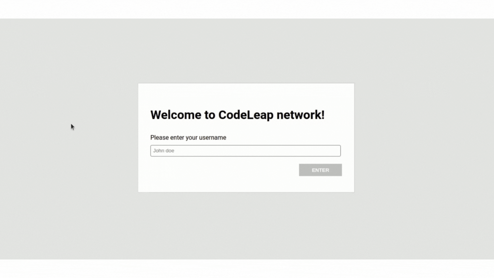

# Code Leap - Frontend Jr Test
### Website delivered: https://code-leap-test-8cn06wivj-ninamarq.vercel.app/
### Completed Website: https://code-leap-test-pl8zwx6hb-ninamarq.vercel.app/
[Pull-Request Completed Project](https://github.com/ninamarq/code-leap-test/pull/7)

# 📁 Technologies #
This project was developed using the following technologies:

* <a href="https://reactjs.org/">React.js</a>
* <a href="https://www.typescriptlang.org/">Typescript</a>
* <a href="https://sass-lang.com/">Sass/CSS</a>
* <a href="https://react-icons.github.io/react-icons/">React Icons</a>
* <a href="https://www.npmjs.com/package/eslint-config-airbnb-typescript?msclkid=b81bf0c6ba0411ec9ea2bdfdab755000">Eslint Airbnb Typescript</a>

# 🎬 Demonstration

# Getting started #
**Clone the project and access the folder**
~~~
$ git clone git@github.com:ninamarq/code-leap-test.git && cd code-leap-test
~~~
If you want to see the completed project, you'll need to pull from the branch `completed-project`

**Follow the steps below**
~~~
# Install the dependencies
$ yarn install
~~~

~~~
# Run the project
$ yarn start
~~~

~~~
The app will be available for access on your browser at http://localhost:3000
~~~
# ✨ special thanks ✨ #
Code with 💙 by me!, [Marina Marques](https://www.linkedin.com/in/marina-marqueso/)
